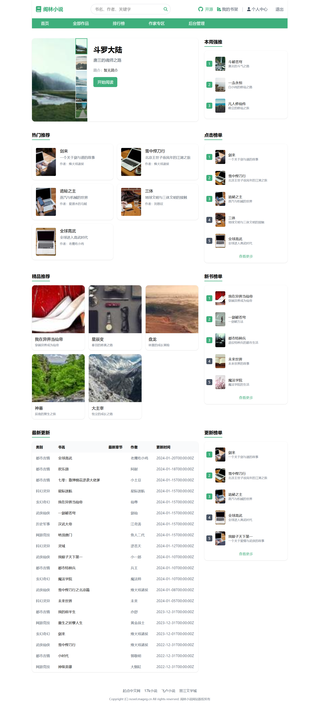
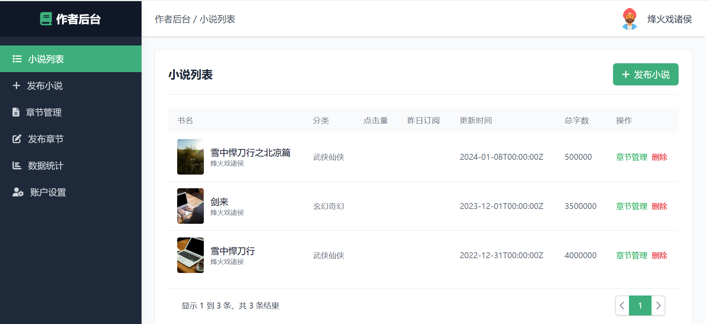

# 阁林小说 - 开源小说阅读与创作平台

[](https://github.com/mageg-x/novel/blob/main/LICENSE)
[](https://github.com/mageg-x/novel/stargazers)
[](https://github.com/mageg-x/novel/network)
[](https://github.com/mageg-x/novel/issues)

## 📚 项目介绍

阁林小说是一个功能完备的开源小说阅读与创作平台，旨在为用户提供高品质的阅读体验和便捷的创作环境。平台支持多端阅读，无需安装额外依赖，可在各种设备上流畅运行。

### 🎯 Demo演示
- **在线体验**: [http://110.42.45.16:3100/home](http://110.42.45.16:3100/home)

## ✨ 功能特性

### 📖 读者端功能
- **多端阅读**：支持PC端和移动端访问
- **小说搜索**：快速搜索喜欢的小说
- **分类浏览**：按类别筛选小说
- **排行榜**：查看热门小说排行
- **书架管理**：收藏喜爱的小说
- **阅读设置**：自定义阅读主题、字体大小
- **评论互动**：与其他读者交流感想

### 🖋️ 作家端功能
- **小说发布**：轻松发布原创小说
- **章节管理**：编辑、删除、排序章节
- **作品数据**：查看作品阅读量、收藏量
- **评论管理**：回复读者评论

### 🔧 管理员端功能
- **用户管理**：管理读者和作家账户
- **内容审核**：审核小说内容
- **分类管理**：配置小说分类
- **系统设置**：平台基本配置

### 🚀 技术特性
- **独立运行**：单二进制文件，无外部依赖
- **资源高效**：低内存占用，适合低端设备
- **响应式设计**：适配不同屏幕尺寸
- **数据安全**：用户数据加密存储

## 📸 产品截图

### 首页界面


### 小说详情页


### 作家后台


### 管理员后台


## 🛠️ 技术栈

### 前端
- **框架**：Vue 3 + Vite
- **状态管理**：Pinia
- **路由**：Vue Router
- **UI框架**：Tailwind CSS
- **HTTP请求**：Axios
- **国际化**：Vue I18n

### 后端
- **语言**：Go 1.24+
- **Web框架**：Gin
- **ORM**：GORM
- **数据库**：SQLite (嵌入式数据库)
- **搜索**：Bleve (全文搜索引擎)
- **日志**：Logrus
- **认证**：JWT

## 📦 快速开始

### 环境要求
- Go 1.24+ (编译后端)
- Node.js 18+ (编译前端)

### 安装步骤

#### 1. 克隆仓库
```bash
git clone https://github.com/mageg-x/novel.git
cd novel
```

#### 2. 编译前端
```bash
cd frontend
npm install
npm run build
```

#### 3. 编译后端
```bash
cd ../server
go build -o novel main.go
```

#### 4. 运行程序
```bash
./novel
```

默认情况下，服务将在 `http://localhost:8000` 启动。

## 📁 项目结构

```
novel/
├── frontend/          # 前端代码
│   ├── src/
│   │   ├── api/       # API请求封装
│   │   ├── assets/    # 静态资源
│   │   ├── components/# Vue组件
│   │   ├── router/    # 路由配置
│   │   ├── stores/    # Pinia状态管理
│   │   ├── views/     # 页面组件
│   │   ├── App.vue    # 根组件
│   │   └── main.js    # 入口文件
│   ├── index.html
│   └── package.json
├── server/            # 后端代码
│   ├── data/          # 数据文件
│   ├── logs/          # 日志文件
│   ├── src/           # 源代码
│   │   ├── handler/   # 请求处理器
│   │   ├── model/     # 数据模型
│   │   ├── router/    # 路由配置
│   │   ├── service/   # 业务逻辑
│   │   └── util/      # 工具函数
│   ├── main.go        # 入口文件
│   └── go.mod         # Go模块配置
└── README.md          # 项目文档
```

## 🚀 使用说明

### 访问平台
1. 打开浏览器访问 `http://localhost:8000`
2. 注册读者账户或作家账户
3. 开始阅读或创作小说

### 管理员访问
- 登录账户后，访问 `http://localhost:8000/admin` 进入管理后台
- 默认管理员账户：`admin@example.com`，密码：`123456`（首次登录后请修改密码）

### 作家后台
- 登录作家账户后，访问 `http://localhost:8000/author` 进入作家后台

## 🤝 贡献指南

我们欢迎所有形式的贡献，包括但不限于：

1. 提交Issue报告Bug或提出新功能建议
2. 提交Pull Request修复Bug或实现新功能
3. 改进文档
4. 帮助测试

### 贡献流程
1. Fork本仓库
2. 创建功能分支：`git checkout -b feature/your-feature`
3. 提交更改：`git commit -m 'Add some feature'`
4. 推送到分支：`git push origin feature/your-feature`
5. 提交Pull Request

## 📄 许可证

本项目采用MIT许可证，详情请查看 [LICENSE](LICENSE) 文件。

## 📧 联系方式

- 项目地址：https://github.com/mageg-x/novel
- 问题反馈：https://github.com/mageg-x/novel/issues

## 🙏 致谢

感谢所有为本项目做出贡献的开发者和用户！

---

**阁林小说** - 让阅读和创作变得更简单！